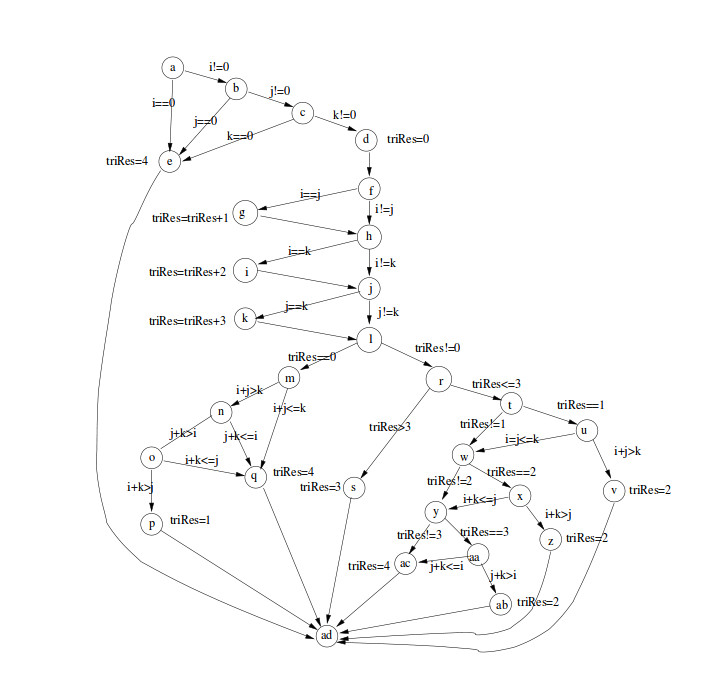

##Cahier des charges
###Générateur de graphe de flot de contrôle

Mickaël Brenoit  
Pierre Limballe  
Auguste Meyer  
Léo Bordy  
Morgane Cabrol  
Geoffrey Glangine  
Anthony schwartzman  
Hervé Poifol 

---------------
###Sommaire:
1. Description du projet
 1. Les objectifs
 2. Les différentes fonctionnalités
 3. Les fonctionnalités envisageable par la suite
2. Les contraintes
 1. Contraintes matérielles
 2. Contraintes temporelles
3. Les ressources
 1. Les ressources humaines
 2. Les ressources matérielles
4. Déroulement du projet
 1. planification
5. Description détaillé du projet
 1. blablabla

### Introduction :

Un graphe de flot de contrôle est un graphe permettant de pouvoir visualiser l'architecture d'un programme informatique pour ensuite pouvoir créer des cas de test sans risquer d'en oublier. Ce document présente un cahier des charges pour une application permettant de pouvoir générer automatiquement le graphe de flux de contrôle d'une méthode ou d'une fonction. Cette application sera réalisée en une année dans le cadre d'un projet tuteuré réalisé a l'IUT de Belfort-Montbéliard dans le département informatique.
*exemple de graphe*

1 **Description du projet:**

 1 *Les objectifs :*
	
Le but de ce projet est de réaliser un logiciel qui permettra à l'utilisateur d'importer son code java afin d'en obtenir le graphe de flot de contrôle.

 2 *Les différentes fonctionnalités :*
	
  * L'utilisateur pourra importer son code java 

  * Le logiciel lira le code java et le parcourra pour en créer le graphe de flot de contrôle 

  * Une interface graphique permettra à l'utilisateur de modifier 	l'apparence du graphe crée

  * Le graphe pourra être exporté sous plusieurs formats (PDF, tex... )

 3 *Fonctionnalités envisageables par la suite :*

  * L'utilisateur pourra importer son code en langage java ou c

  * L'utilisateur pourra directement taper sons code dans l'application
2 **Les contraintes :**
	
 1 *Contraintes matériel :*

  * Le logiciel sera portable sous toutes les plates forme (JAVA) 

  * L'application sera fait en langage Java, nous utiliserons donc plusieurs bibliothèque Java.De plus il comportera une interface graphique, nous utiliserons donc la librairie SWING. 

  * Le logiciel permettra d'exporter le graphe de flux de contrôle sous plusieurs format il faudra donc utiliser des bibliothèques le permettant.

 2 *Contraintes temporelles :*

Une version bêta du projet doit être utilisable à la fin du mois d'octobre 2014. 

3 **Les ressources: **
 
 1 *Ressources humaines :*
	
Se projet sera réalisés par huit étudiants en 2ème année de DUT informatique.

 2 *Ressource matérielles :*
	
  * Latex : Pour un manuel utilisateur plus présentable
  * GitHub : Pour partager/ organiser le travail plus facilement
  * Eclipse : Pour compiler/ coder en Java 

4 **Déroulement du projet :**

 1 *Planification :*
	
  * Analyse des objectifs
  * Réalisation du cahier des charges
  * Réalisation d'un Modèle Conceptuel de donnée 
  * Répartition des taches 
  * Développement
  * Réalisation du manuel utilisateur
  * Réalisation du rapport
  * Mise en place du projet

5 **Description détaillée du projet :**
	
Le projet apparaitra sous forme d'une fenetre qui contiendra un bouton permmettant à l'utilisateur d'importer son code. 
	Ensuite, une deuxieme fenêtre s'ouvrira contenant le graphe de flot de contrôle généré.
	Cette fenetre permettra à l'utilisateur de modifier l'apparrence de son graphe. Enfin cette dernière fenêtre contiendra plusieurs boutons permettant d'exporter le graphe sous plusieurs formats après modification.

### Conclusion :

Ce projet est original car il existe peu de logiciel de ce type gratuit. Il permettra de faciliter et accélérer la phase de test des programmes que chaque informaticiens se doit de réaliser sur ses projets. 

